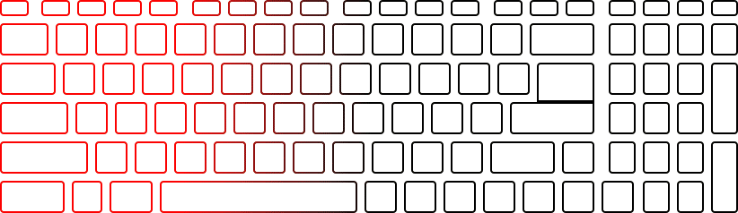

This is an Mac OS X command-line utility which allows to control keyboard's backlight on MSI laptops that support SteelSeries Engine 2.

## Supported Modes

### Normal


```
$ msikeyboardbacklightcontroller --normal --color1 green --color2 yellow --color3 orange
```

Set normal mode where each keyboard segment is constantly illuminated using specified color.

### Gaming


```
$ msikeyboardbacklightcontroller --gaming --color yellow
```

Set gaming mode where only left keyboard segment is illuminated while others are turned off.

### Dual Color


```
$ msikeyboardbacklightcontroller --dualcolor --color1 purple --color2 orange
```

Set dual color mode where color of keyboard's backlight crossfades between two specified colors.

### Wave



```
$ msikeyboardbacklightcontroller --wave --color1 red --color2 orange --color3 green
```

Set wave mode where all three sections of keyboard are sequentially lit from left to right using specified colors.

### Breathing


```
$ msikeyboardbacklightcontroller --breathing --color1 red --color2 orange --color3 green
```

Set breathing mode where backlight of all keyboard segments crossfades between turned on and turned off state.

### ~~Audio~~

Unfortunately, this mode relies on Realtek audio driver and thus can't be implemented for non-Windows OS.

## Installation

Build the project or download precompiled binary and copy it to /usr/local/bin. To automatically apply last backlight configuration after reboot copy User Agent com.rd.msikeyboardbacklightcontroller.plist to ~/Library/LaunchAgents/.

## Tested on

* MSI GS60-2PL

## Contributing

If you have an MSI laptop with configurable backlight running Mac OS X, give this utility a try :+1: and tell about results by opening issues or adding you laptop to the list of tested models.
